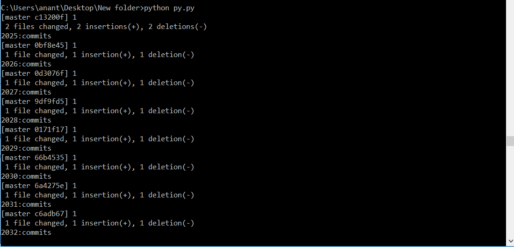

#So, I did 12K commits in Github within 24 hrs by running an automated program.

In every 2 hours, the commits will automatically be increased by 1000.

**See my work. Give ⭐️ 👏**

# Directly Use

https://www.npmjs.com/package/git-unlimited-commit

# See code

https://github.com/Anant016/git-unlimited-commits-contributions

